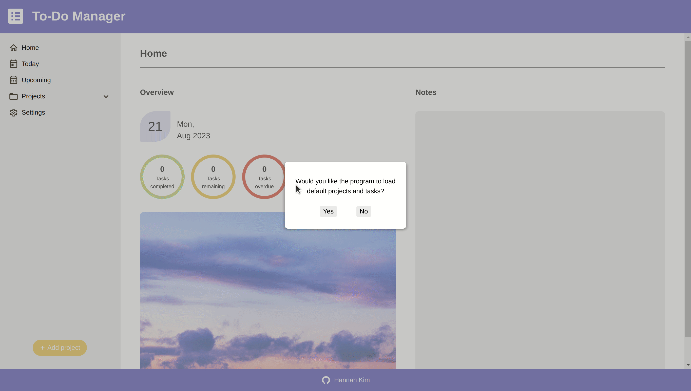

# To-Do Manager
https://hannahkim313.github.io/to-do-manager/

## Project Summary
This project exercise, created by The Odin Project, is a to-do list manager that allows a user to create and manage both projects and individual tasks. The application also takes advantage of the Web Storage API by using local storage to save and store data. In doing so, the user can access all data created in their last session when reopening the application on the same computer.

## In Action
### Features Overview

## Features to Implement/Improve
* None at this time.

## Reflection
Before beginning this project, I did not realize how much time it would take as well as the number of obstacles I would hit to implement all the features I wanted to incorporate in this application. However, because of the complexity of this project, I learned how to better manage functions and modules using OOP principles, organize a large number of files and directories, and embrace the never-ending process of refactoring my code.
  
## Credits
* [Sky image](https://www.freepik.com/free-photo/colorful-cloudy-sky-sunset-gradient-color-sky-texture-abstract-nature-background-very-peri_22756562.htm#&position=10&from_view=author) by [user14908974](https://www.freepik.com/author/user14908974) on Freepik

* Miscellaneous icons provided by [Material Design Icons](https://pictogrammers.com/library/mdi/)